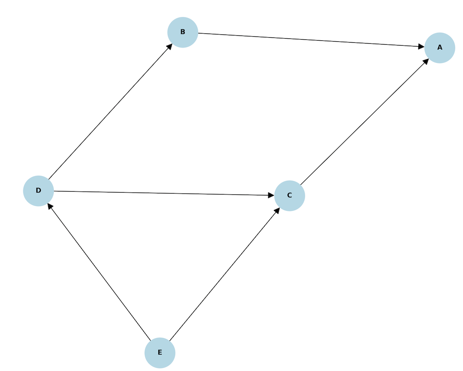

### Claude in action

So I used the Cursor AI-assisted integrated development environment (IDE)  pointing to the claude-3.5-sonnet model and asked it to build a dependency diagram example.  We have a big project at work and am looking to map out all the dependencies like a king.  Well, claude wrote the code like a king and it worked first try.

<!-- truncate -->

I asked it to give me layout options and it did that as well.

More on Cursor later.



### Prompt


Write a program that will take a list of items and dependencies to produce a graph showing the items with relation to their dependencies.

### Code


```
import networkx as nx
import matplotlib.pyplot as plt

def create_dependency_graph(dependencies):
    """
    Create and visualize a directed graph from a dictionary of dependencies.
    
    Args:
        dependencies (dict): Dictionary where keys are items and values are lists of dependencies
    """
    # Create a directed graph
    G = nx.DiGraph()
    
    # Add nodes and edges from the dependencies
    for item, deps in dependencies.items():
        # Add the main item if it doesn't exist
        if item not in G:
            G.add_node(item)
        
        # Add dependencies and edges
        for dep in deps:
            if dep not in G:
                G.add_node(dep)
            G.add_edge(dep, item)  # Arrow points from dependency to dependent item
    
    # Create the visualization
    plt.figure(figsize=(10, 8))
    pos = nx.spring_layout(G)
    
    # Draw the graph
    nx.draw(G, pos, with_labels=True, node_color='lightblue', 
            node_size=2000, arrowsize=20, 
            font_size=10, font_weight='bold')
    
    plt.title("Dependency Graph")
    plt.show()

```

### Example usage


```
if __name__ == "__main__":
    # Example dependencies dictionary
    dependencies = {
        'A': ['B', 'C'],
        'B': ['D'],
        'C': ['D', 'E'],
        'D': ['E'],
        'E': []
    }
    
create_dependency_graph(dependencies)


```
