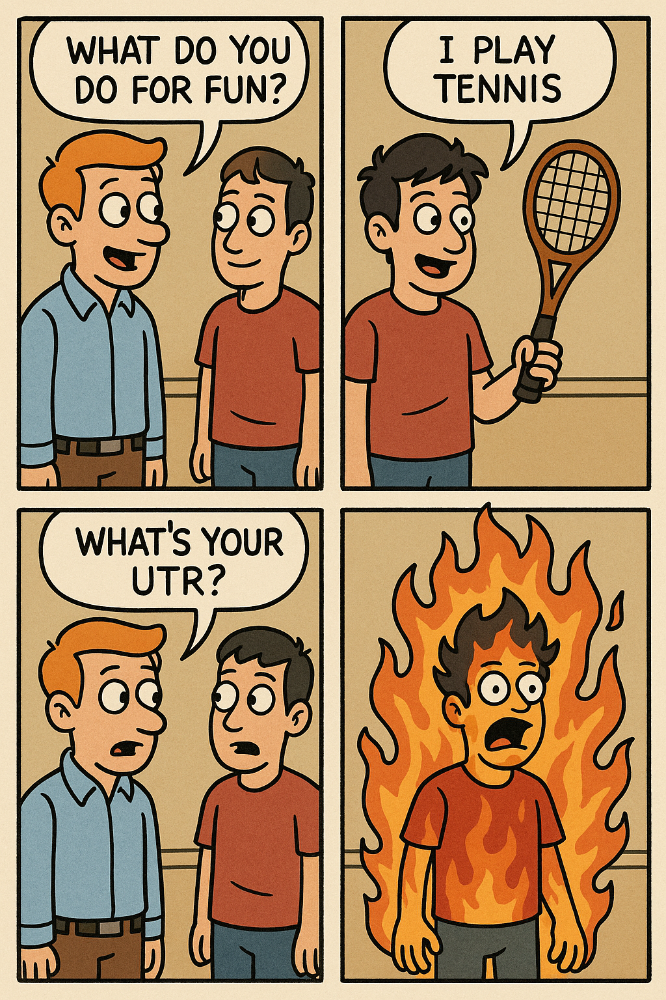
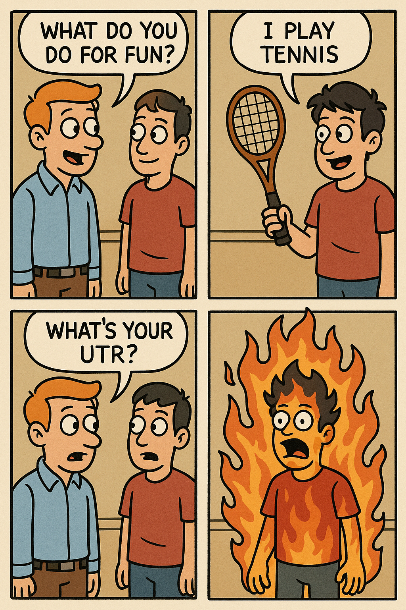

### AI Makes a Comic 5 Minutes After the Conversation Right in the Room Where it Happened!

Ok, this is absolutely insane.  I overheard this loud interview in a popular Palo Alto Coffeeshop known for caffeinating heavy hitters, tech bros and sisters.

The interviewer breaks the ice with a nice causal "What do you do for fun?."

The interviewee replies with "I play tennis."

In peak, competitive, tech-bro, prove-it attitude, the interviewer fires off "What's your UTR?"

I'm knocked back.  The interviewee is stunned.  A comic comes to mind in my head and I can't draw for shit.

<!-- truncate -->

UTR?  What's that? I quickly google it as I used to play tennis casually.  Well, it turns out there's an app for that, it's called the Universal Tennis Rating and you can sign up to compete and find out your UTR at https://www.utrsports.net/pages/how-utr-works.

### HA HA HA, It's AI Time!

OK.  So I heard ChatGPT has cooked on image generation.  Let's check it out.

Let's do a quick prompt.  This is all one shot it here is the chat where it happened... https://chatgpt.com/share/680aaa72-938c-800f-9f5a-c4e883e5c3d5

I ask it, "Make a cartoon where one guy asks the other what he does for fun.  The other guy answers "I play Tennis".  Then the first guy asks "What's your UTR?".  Then show the second guy going up in flames"

It thinks for a bit and responds with:

HOLY COW!  It nailed it!

Exactly the effect I was looking for!  Text is correct, the only issue I have is the right panels have the character facing the wrong way.  That's easy to fix.

I went ahead and loaded the image into Apple Preview and flipped the character to make it like so.

Boom.  Done.  I even told ChatGPT I was happy with the result.

"nailed it!"

And then ChatGPT must have heard me laughing at how amazing and funny this is.

"Haha, glad you liked it! Let me know if you want to make another one—could go deep with tennis trauma comics 😄🎾🔥"

Tennis trauma!  Just hilarious!

As of this typing, the interview is not even a half hour in!

This is how fast life can move with AI!

Enjoy!

